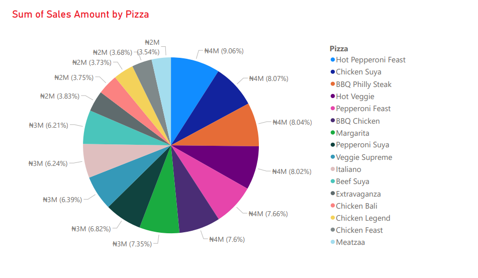
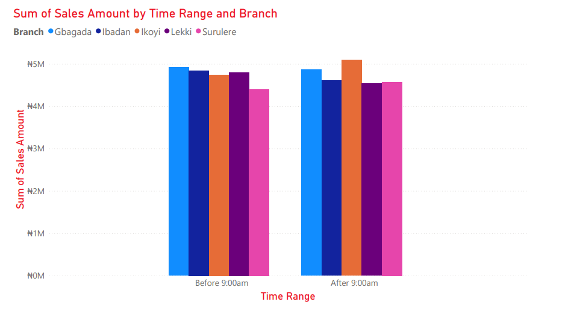
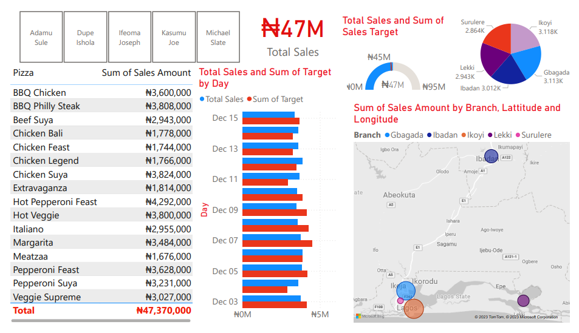

# [Project 1: Unraveling Domino's](https://github.com/Niyanta-Verma/Dominos-data-analysis)
<h2>Domino's Data Analysis and Visualization using Power BI</h2>

<h3>1. Metadata:</h3>
1. The dataset is of a Domino's Franchise in Nigeria. 
2. There are 4 tables altogether: 1 Fact table and 3 Dimension tables.
3. The dataset essentially contains the following 2 week sales info of 5 Domino's outlets in Nigeria:
* Pizzas sold,
* Pizza Price,
* Branch names and their managers,
* Sales amount,
* Sales Taget, etc.

<h3>2. Tech Stack:</h3>
1. Power BI

<h3>3. Goal:</h3>
Answering questions and building an interactive dashboard.

<h3>4. Workflow:</h3>
1. Forming questions
2. Data Cleaning/Wrangling
3. Data Modelling
4. Data Visualization

<h3>5. Insights:</h3>
This section is going to walk you through some of the questions and visualizations done in the project.

<h4>1. How are different types of pizzas contributing to the total sales?</h4>

<h4>2. What branches are the busiest in what time range?</h4>

<h4>3. Complete Dashboard</h4>

